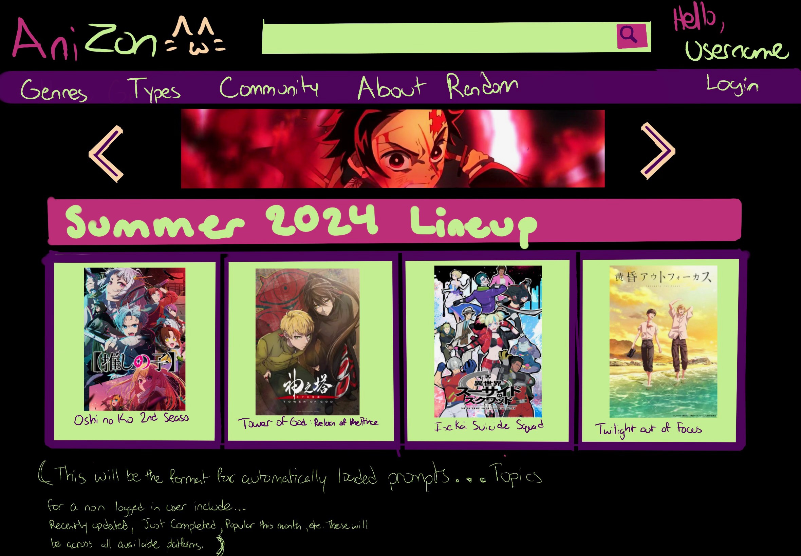
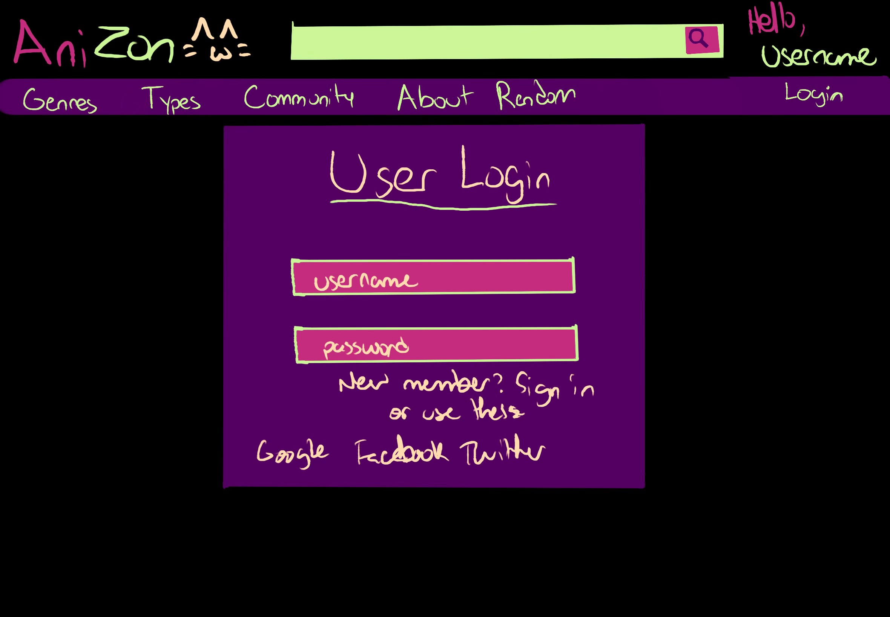
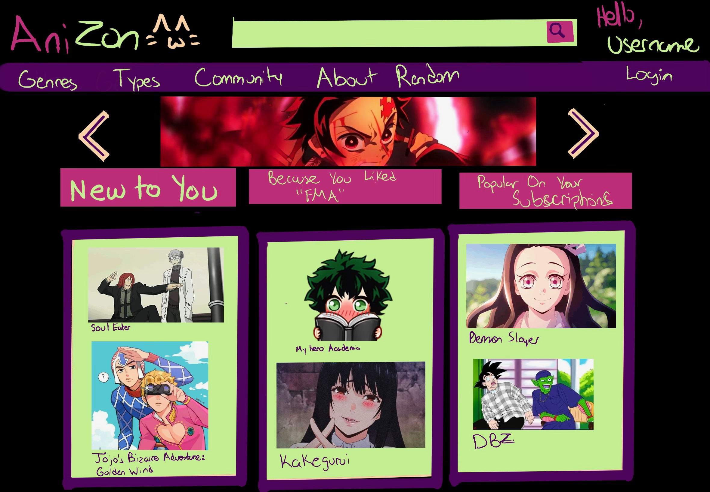
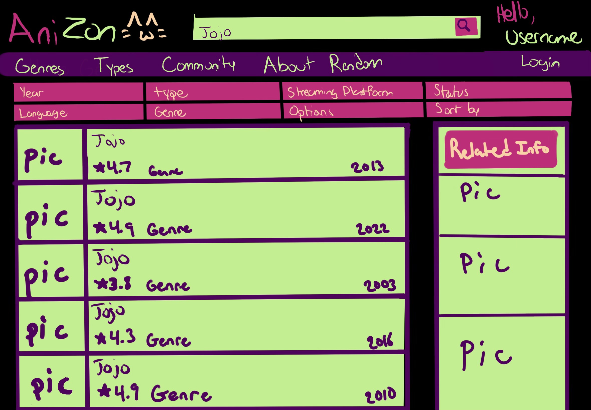

# Anizon

## Overview
**Anizon** takes anime that a user has watched and their streaming platforms to recommend new anime. The app streamlines the experience for users with multiple streaming services.

For example:
- Watching **Vinland Saga**, but prefer the Netflix dub over Crunchyroll's? Not a problem!
- Not sure which platform offers a specific anime? We'll help you find it.
- Looking for anime to watch across platforms like Crunchyroll, Netflix, Amazon Prime, or Hulu? Anizon has you covered.

**Anizon** is an anime recommendation app currently under development. The app aims to provide users with personalized anime recommendations based on their preferences, showcasing full-stack development expertise and secure user authentication.

## Features Being Worked On
- **Personalized Recommendations**: Tailored anime suggestions based on user preferences.
- **User Authentication**: Secure login and registration system powered by Amazon Cognito.
- **Responsive Design**: Intuitive and engaging user interface for seamless user experience.
- **Data Management**: Efficient handling of user data and preferences.

## Tech Stack
- **Frontend**: React, TypeScript
- **Backend**: Java 17, Spring Boot 3
- **Database**: MySQL
- **Authentication**: Amazon Cognito
- **Hosting**: AWS (planned)

## Current Progress
- Screenshots and UI designs added to `src/main/resources/images/`.
- Initial frontend layout and components created using React and TypeScript.
- Backend API endpoints under development with Spring Boot.
- User authentication integration in progress using Amazon Cognito.

## Planned Features

### User Functionality
1. **Account Management**
    - **User Authentication**: Secure login and registration with Amazon Cognito.
    - **Profile Customization**: Manage nickname, watched anime, streaming service subscriptions, and review preferences.

2. **Anime Discovery**
    - **Search by Title**: Locate anime by entering a partial or full title (e.g., `getAnimeByTitleContaining(String text)`).
    - **Search by Streaming Platform**: Find anime available on specific platforms subscribed by the user (e.g., Netflix, Hulu).
    - **Filter by Dub/Sub**: Sort anime based on language preferences (sub or dub).
    - **Search by Tags or Year** *(Medium Priority)*: Filter anime by specific tags (e.g., genres) or release year.

3. **Recommendations**
    - **Personalized Recommendations**: Generate a list of anime based on:
        - Watched anime.
        - Streaming services.
        - Language preferences (sub/dub).
    - **Highest-Rated Recommendations**: Suggest anime based on the user’s highly-rated selections.
    - **Upcoming Releases**: Provide a list of upcoming anime based on the user’s streaming services.
    - **Upcoming Anime Recommendations** *(Frontend Logic)*: Tailor upcoming releases based on user preferences.

4. **Reviews**
    - **Write Reviews**: Submit star ratings, review text, and spoiler tags for anime.
    - **View Reviews**:
        - Filter by star rating.
        - Exclude reviews with spoilers.
    - **Manage Reviews**:
        - Edit and delete previously submitted reviews.

### Admin/Backend Functionality
1. **Data Management**
    - **Add Watched Anime**: Enable users to update their watched list dynamically.
    - **Update Available Titles**: Ensure anime title availability is refreshed per platform *(Low Priority)*.

2. **Integration with External APIs**
    - **Streaming Availability**: Retrieve streaming platforms for specific anime titles.
    - **NLP/Content Analysis** *(Low Priority)*:
        - Analyze user reviews to suggest anime with similar descriptions.

## Screenshots
### Data Model Diagram

### Back-End UML Diagram

## Webpages

### Landing Page

### User Login

### User Home

### Search Results

